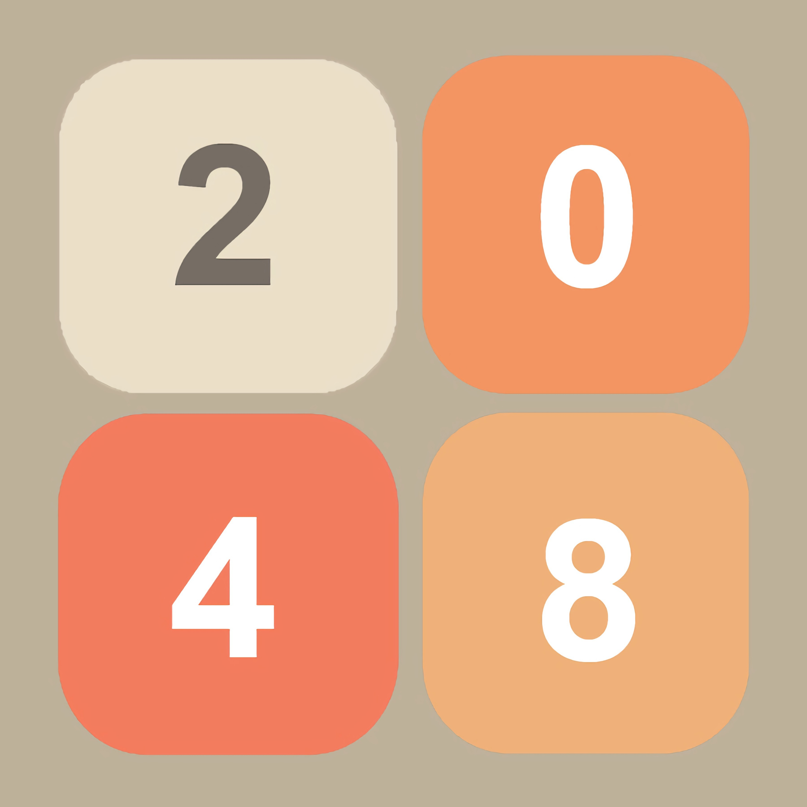

# 2048 game

<!-- PROJECT LOGO -->
 

  
  
 
 &#8657; попробовать &#8657; 

<!-- ABOUT THE PROJECT -->

## Правила игры:

### Старт уровня:

• игрок запускается сразу на пустом уровне, где есть 2 плитки с
цифрой «2». Счёт изначально равен 0.

### Определение хода:

• Игрок может пролистнуть (нажать, сдвинуть курсор/палец,
отпустить) в одну из сторон: влево, вправо, вверх, вниз. Должно
быть минимальное расстояние, на которое игрок должен
сдвинуть курсор, чтобы это посчиталось за ход. Если игрок
сдвигает курсор/палец по диагонали, но ход делается
относительно той оси, по которой он сделал большее движение.
Например, если игрок сдвинул курсор на 200px вверх и 180px
вправо, то совершается ход вверх. Также доступно управление клавиатурой.

### Какие плитки можно соединить?

• Плитки можно соединить, если они имеют одинаковое значение
и находятся рядом (имеют 1 общее ребро).
После хода игрока:

• Все плитки сдвигаются в требуемом направлении

o Если 2 плитки находятся рядом и сдвигаются «друг к
другу», то они соединяются в 1 плитку со значением, в 2
раза больше. Значения старых плиток прибавляются в
счёт.

• После хода на поле в случайном месте появляется новая плитка.

### Новый ход:

С вероятностью 90% это плитка со значением «2», с
вероятностью 10% - со значением «4».

### Условия победы и проигрыша:

• Если после хода на поле появляется плитка со значением
«2048», то появляется надпись с текстом "YOU WIN!".
После нажатия «Try again» игра начинается заново.
• Если после хода и добавления новой плитки возникает ситуация,
что не существует плиток, которые можно соединить,
появляется надпись с текстом "GAME OVER!". После
нажатия «Try again» игра начинается заново.
:

## Механика игры:

### Старт

-Создаю две ячейки

-Рисую счёт

-Включаю отрисовку тела

-Включаю управление клавиатурой

-Включаю управление мышкой

-Включаю управление тачпадом

-Включаю отслеживание координат курсором \(на случай, если он будет над активной кнопкой - тогда курсор изменится)

### Ход:

#### Подготовка:

Проверка на блок хода

Ставлю направление

Ставлю блок хода

Включаю отрисовку тела на две фазы

#### Фаза 1:

Раздаю билеты ячейкам

Двигаю ячейки \(пошаговое движение)

#### Фаза 2:

Включаю анимации:

а) появления новой ячейки
б) слияния двух ячеек

Меняю значения переменных ячеек

Пересчитываю заного координаты всех ячеек \( защита от мелких погрешностей)

Считаю счёт

Рисую счёт

Удаляю старые ячейки \(только одна из пары удаляется, вторая становится в два раза больше в результате слияния)

Проверка на движение \(если хотя бы одна ячейка поменяла своё положение, то ход считается состоявшимся)

&#9940;**Если ход был не состоявшимся, то на этом этапе функция прерывается**

Создание ячейки

Проверка на победу

Проверка на луз

#### После хода:

Анимация тела прекращается

Если ни луз, ни победа, то снимается блок хода

### Победа:

#### Условие:

Проверяю значения всех ячеек, если хоть одна равна 2048 - победа

#### Действия:

Поле накрывает полупрозрачный золотой фон

Появляется надпись "YOU WIN!"

Появляется кнопка "Try again", которая перезапустит игру

## Связи файлов:

index.html > index.js

index.js > App.js

App. js > {Drawer.js, Controller.js, Field.js }

Field.js > {Button.js, Cell.js}

## Модули

App.js - Логика основной части приложения

Controller.js - отслеживает действия пользователя

Field.js - хранит массив ячеек и прочую информацию

Drawer.js - занимается отрисовкой

Cell.js - вспомогательный модуль для ячеек

### Controller.js

Реагирует на события:
'keydown'
'mousedown'
'mouseup'
'mousemove'
'touchstart'
'touchmove'
'touchend'

А 'click' - вне канваса, на кнопки админ панели

Создаёт 4 типа взаимодействия, а также на 5 кнопок админки

Основа:

1. ход

Мышкой, клавиатурой или тачпадом было совершенно действие, удовлетворяющее условиям совершения хода.

2. Перемещение мыши
   Считываются и записываются координаты мыши, что позволяет взаимодействовать с кликабельными объектами канваса, в том числе и без нажатия (изменение курсора)

3. Клик

Мышкой или тачпадом

4. Нажатие тачпада

Отличается от клика мышкой еще тем, что в данном случается передаются координаты нажатия

Кнопки:

makeLose - сделать проигрыш

makeWin - сделать победу
makePrewinSituation - сделать ситуацию в 1 ход до победы

makePreloseSituation - сделать ситуацию в 1 ход до поражения

startNewGame - новая игра

### Drawer.js

Есть 3 элемента отрисовки:

Drawer.#drawBackground() - рисует фон

Drawer.drawButton() - рисует кнопки Try again

Drawer.drawWin() - накладывает прозрачный вон и надпись "YOU WIN"

Drawer.drawLose() - накладывает прозрачный фон и надпись "GAME OVER"

Drawer.drawCells() - рисует клетки с номерами

Drawer.drawScore() - рисует счёт

Drawer.runBodyDrawer() - многократно вызывает метод Drawer.drawCells() за счёт чего мы видим анимацию

### Cell.js

Класс ячеек, в нём описан конструктор, сетер (многоразовый сетер, который обновляает данные после хода), а также 3 метода для ячеек:

1. animateMerge - анимация слияния. Постепенно увеличивает размер ячейки от обычного до большого

2. animateCreating - анимация создания. Постепенно увеличивает размер ячейки от маленького до нормального (Если быть точным, он уменьшает уменьшение, переменную sizePenalty которая показывает, насколько ячсейка будет меньше, чем должна быть)

3. stopAnimating - обнуляет все коэфийциенты анимаций

### Field.js

содержит следующие данные:

moveDeltaXY - изменение координат при движение

score - счёт

cellArray - массив ячеек

moveDirection - направление движения во время хода

phaseTime - время одной фазы (половина хода)

winStatus - статус победы

loseStatus - статус проигрыша

moveDetected - было ли замечено движение во время хода (1 если да, от этого зависет, будет ли засчитан ход)

columnArray - многомерный массив, для упрощения расчёта конечного номера, которая примет ячейка в конце движения

turnBlock - блокатор хода (не даёт сделать ход, пока не закончен предидущий)

2 метода:

getCellFromNumber(number) - возвращает объект ячейки с соотвествующим номером (поиск происходит из уже существующих ячеек)

createCell - создаёт новую ячейку

А также объект кнопки:

buttonTryAgain - Кнопка "Try again" содержит координаты, чтобы можно было расчитать, когда курсор над кнопкой и засчитать нажатие по ней

### App.js

Имееет 3 основных метода и множество дополнительных:

1. run()

Запускает приложение в первый раз, а именно подключает контроллер и запускает новую игру

2)startNewGame()

Начинает новую игру, а именно: все изменные за игру данные приводит к первоначальному виду, создаёт две ячейки, включает вычисление динамических размеров ячеек (при появлении, или слиянии - размеры какое-то время меняются), а также динамически рисует тело и счёт

3. makeTurn()

совершает ход

## Тесты:

04.07.23 19:00

1. загрузка прошла

2. стрелки работают

3. пароль админа работает

4. все кнопки админки срабатывают

5. управление мышкой работает

6. интер работает

7. быстро нажатие - без проблем

8. зажатие стрелок - без проблем

9. ломаные нажатия мышки на кнопки - не срабатывают

10. проиграть на пк - без проблем

11. выиграть на пк - без проблем

12. тачпад работает

13. проиграть на телефоне - без проблем

14. выиграть на телефоне - без проблем

## Тайминги:

    Пошёл ход:

    0s

    запусается интервальный  drawCells() в течении 2 phaseTime

    запусакется timerMakeStep() - ячейки начинают двигаться в течении 1 phaseTime

    1 phaseTime

    Заканчивается timerMakeStep()

    Смена данных ячеек

    выбор действия, которое сработает через 1 phaseTime:

    {

    	Если луз или вин, через 1 phaseTime сработает  одно из этих событий

    	Если оба не сработали - через 1 phaseTime снимается блок хода

    }

    2 phaseTime

    Срабатывает одно из событий в скобках

    Заканчивается прорисовка

## Дополнительно:

Введите с клавиатуры "admin" для доступа к панели администратора.
